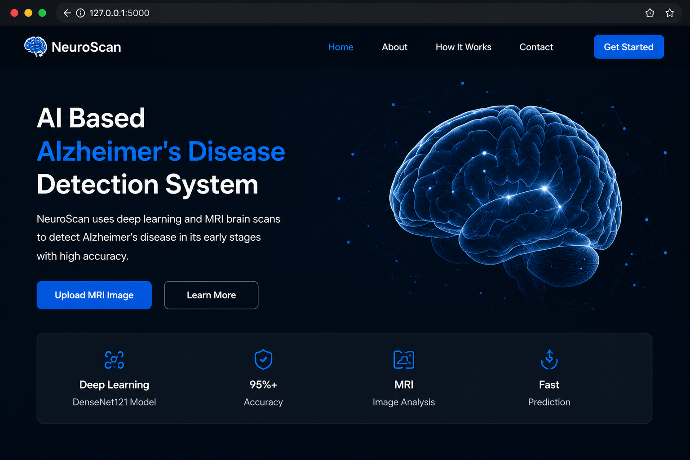
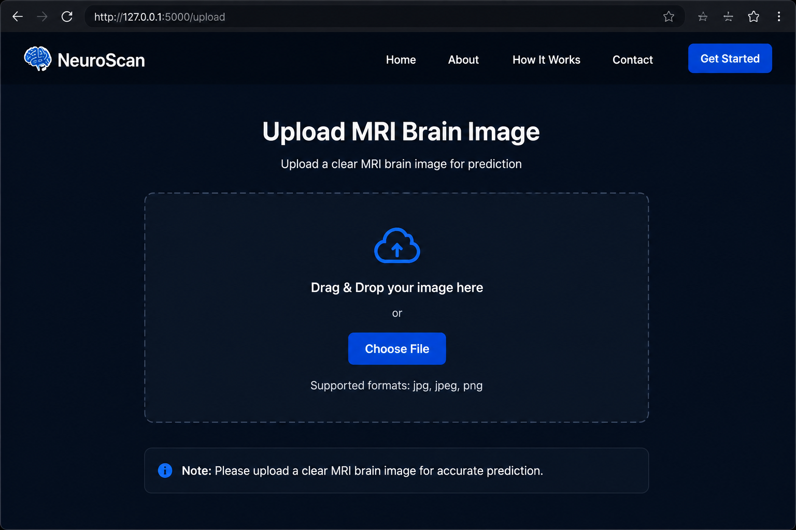
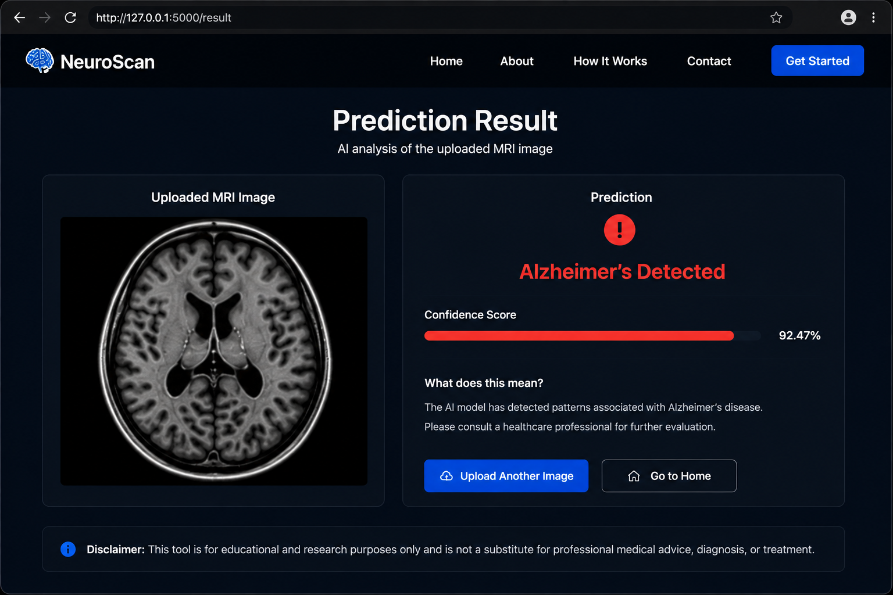

# NeuroScan - AI Based Alzheimer's Disease Detection System

## Overview

NeuroScan is an AI-powered web application that detects Alzheimer's disease from MRI brain scans using Deep Learning and Computer Vision techniques.

## Features

- MRI Image Classification
- Alzheimer's Disease Detection
- Flask Web Application
- Real-Time Prediction
- User-Friendly Interface

## Technologies Used

- Python
- TensorFlow
- OpenCV
- Flask
- DenseNet121
- HTML
- CSS

## Project Structure

```text
dataset/
model/
notebooks/
screenshots/
static/
templates/
app.py
predict.py
train.py
requirements.txt
```

## Installation

```bash
git clone YOUR_REPOSITORY_URL
cd NeuroScan-AI-Based-Alzheimer-s-Disease-Detection-System
pip install -r requirements.txt
python app.py
```

## Screenshots

### Home Page



### Upload Page



### Prediction Result



## Future Enhancements

- AWS Cloud Deployment
- Docker Containerization
- CI/CD Pipeline Integration
- Kubernetes Deployment
